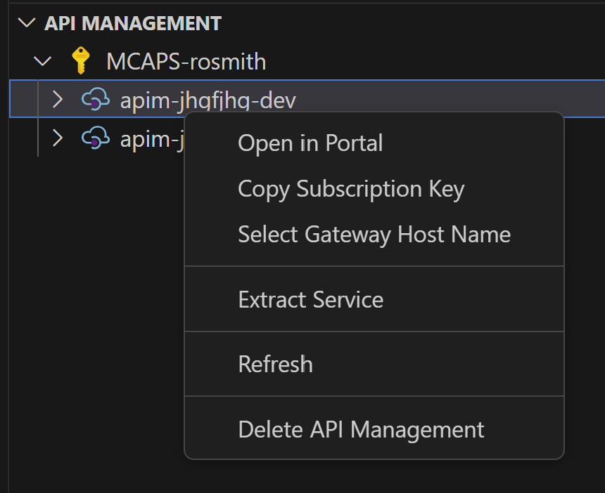
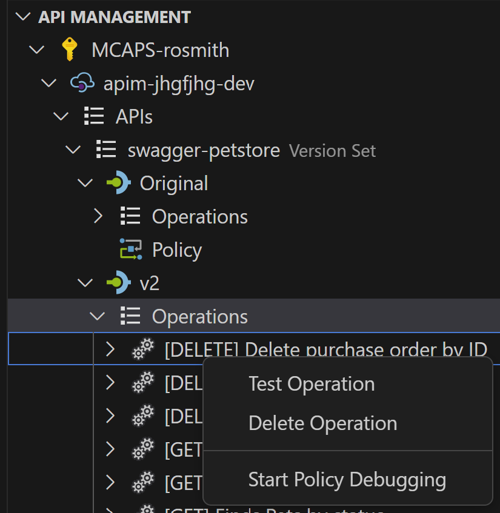
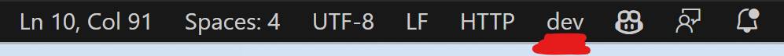

# API Ops Accelerator

The accelerator demonstrates use of [API Ops](https://azure.github.io/apiops/apiops/0-labPrerequisites/) to deploy changes from a development API Management instance to a production instance hosted in separate environments.

## Repository Structure

```text
📂
├── [/.devcontainer](./.devcontainer/) contains the dev container with the installs necessary to run the project.
├── [/.github](./.github/) contains the API Ops GitHub Actions.
├── [/apim_templates](./apim_templates/) contains the API Management templated configuration.
├── [/apim_artifacts](./apim_artifacts/) created when you run `make artifacts-dev` or `make artifacts-prod`.
├── [/assets](./assets/) contains the images and assets used in the README.
├── [/infrastructure](./infrastructure/) contains the Terraform infrastructure.
├── [/scripts](./scripts/) contains scripts used to deploy project infrastructure.
├── [/temp](./temp/) an ignored folder that can be used locally to store extracted API Management configurations.
├── [Makefile](./Makefile) defines the set of operations that can be executed from the command line.
└── [.env.example](./.env.example) contains the environment variables necessary to run the project.
```

## Architecture

Two resource groups are deployed, dev and prod, that contain identical resources. A developer SKU instance of API Management is deployed alongside a number of supporting resources - Key Vault, Log Analytics, Application Insights. The API Management configuration references these services within internal APIM entities.


Configuration details are applied to the dev APIM instance before being published to production.

> **_NOTE:_** The deployed architecture does not currently include the AKS cluster, but rather uses a dummy API provided by the Swagger Petstore. Additionally, the deployed architecture currently only includes the dev and prod environments. Work is ongoing to match the above diagrams.

## Infrastructure overview

For the MVE we'll use 2 environments. Each environment has its own instance of API management in dedicated VNet.

For backend applications we'll use shared AKS cluster. Each environment will have its own Kubernetes namespace. All backend services will be exposed via the same 
ingress and will be available for APIm by urls:
- apim-mve-dev.${some-public-dns-zone}
- apim-mve-prod.${some-public-dns-zone}


## API Management Configuration

The [API Management configuration](./apimartifacts/) contains 3 versions of the [Swagger Petstore API](https://petstore.swagger.io). The separate versions use slightly different versions of the Swagger Petstore Open API spec and thus expose different endpoints/functionalities. The Swagger Petstore is stored as an API Management backend and each API version includes a `<set-backend-service/>` policy that references it. The three API versions are all added to the same `swagger-petstore` Product.

The Application Insights Instrumentation Key is stored as a Key Vault secret, which is referenced by the API Management `Logger-Credentials` named value. API Management contains a Logger resource that connects to the Application Insights resource via the `Logger-Credentials` named value, and sends diagnostics to Log Analytics.

The values stored in the base API Management configuration correspond to the dev environment. Importantly, when the configuration is applied to the prod environment, API Management should connect to the production environment's supporting resources, not the ones in the dev environment. The [configuration.prod.yaml](./configuration.prod.yaml) file is used to override resource IDs to point at the prod environment's Key Vault, Log Analytics, and Application Insights resources. It additionally contains overrides for the Swagger Petstore backend, but the same url is currently used for both environments.

## Spec Transfer Process

The backend APIs fronted by API Management may be developed by a separate team in a different repository. The API Management configuration stored in `/apim_templates` is not a static set of files, and instead must change over time to accommodate changes in the backend APIs. As backend APIs change, their corresponding Open API Specs change as well. As new specs are created by the backend API team, the API Ops team must ingest the files and generate the required changes in API Management.

As new versions of a spec become available, new versions or revisions to an existing version should be created for the corresponding API Management API. Versions and revisions are captured in API Ops as entirely new folders within `/apim_templates/apis`. For reference, the Swagger Petstore API that has 3 versions (each with different spec) has the following corresponding folders in `/apim_templates/apis`:

- `swagger-petstore/`
- `swagger-petstore-v2/`
- `swagger-petstore-v3/`

When a new version of a spec is released, a decision must be made [whether the change is breaking or not](https://learn.microsoft.com/en-us/azure/api-management/api-management-versions#versions-and-revisions). If the change is breaking, a new folder should be created in `/apim_templates/apis` that corresponds to the next available **version**. For the Swagger Petstore API, a new folder named `swagger-petstore-v4` would be created. If the change is not breaking, a new folder should be created in `/apim_templates/apis` that corresponds to the next available **revision** for the version that the spec targets. For the Swagger Petstore API, if the spec referred to a revision to `v3` of the API, a new folder named `swagger-petstore-v3;rev=2` would be created. A subsequent revision would result in a new folder named `swagger-petstore-v3;rev=3`.

API Ops expects each API folder to contain the following files:

- `apiInformation.json`, which contains the API configuration data
- `policy.xml`, which contains the API Policy applied to all API Operations
- `specification.yaml`, which contains the Open API Spec for the API

The `specification.yaml` file for a new version or revision will be the spec that is released by the backend API team. The `apiInformation.json` and `policy.xml` files from the previous versions or revisions should be used as templates to build the `apiInformation.json` and `policy.xml` files necessary for the newly created `/apim_templates/apis` folder. Generally, a new version's `apiInformation.json` will be nearly identical to the previous version's `apiInformation.json` file, with the `apiVersion` property updated. Similarly, a new revision's `apiInformation.json` will be nearly identical to the previous revision's `apiInformation.json` file, with the `apiRevision`, `apiRevisionDescription`, and `isCurrent` properties updated (only one revision may be current for each version). Additional properties may be updated, if necessary.

In addition to the APIM API configuration itself, the API may need to be associated with existing Products. API Ops Products are stored in the `/apim_templates/products` folder, where each Product has it's own directory that corresponds to its name. API Ops uses a few files to define Product configuration, but uses the `/apim_templates/products/{PRODUCT_NAME}/apis.json` file to set the APIs the Product should be associated with. Each `apis.json` file contains an array of API names that correspond to the folders in `/apim_templates/apis`. The name of the newly created `/apim_templates/apis` folder should be added to `apis.json` for each of the Products the new API version/revision should be associated with.

The `backends`, `diagnostics`, `loggers`, and `named values` folders in `/apim_templates` folder do not need to be updated on new spec changes. The url for the backend API does not change on spec updates and the monitoring configuration for the previous versions/revisions of the API will be applied to the new version/revision as well.

In total, when a new version or revision is created, a new folder should be created in `/apim_templates/apis` that includes the following files:

- `/apis/{API_NAME}/apiInformation.json`
- `/apis/{API_NAME}/policy.xml`
- `/apis/{API_NAME}/specification.yaml`

And the `apis.json` file should be updated for each associated Product:

- `/products/{PRODUCT_NAME}/apis.json`

Once the new folder and files are added and updated, the new configuration can be published to API Management.

## Running the Project

Terraform is used to deploy the supporting infrastructure, including the API Management instances, and API Ops handles configuration promotion from the development to production environment.

### Pre-Requisites

- [Terraform](https://www.terraform.io/downloads.html)
- [Azure CLI](https://docs.microsoft.com/cli/azure/install-azure-cli)

This repository comes with a [Dev Container](https://code.visualstudio.com/docs/devcontainers/containers) and all of the pre-requisites are already installed if you use it.

### Running Locally

A makefile provides a frontend to interacting with the project. This makefile is self documentating, and has the following targets:

```text
help                    💬 This help message :)
infra                   🚀 Deploy the API Ops Infrastructure
extract-dev             ⬇️ Export the development API Management instance to a temp local folder
extract-prod            ⬇️ Export the development API Management instance to a temp local folder
publish-dev             ⬆️ Publish to the development API Management instance
# publish-prod          ⬆️ Publish to the production API Management instance
artifacts-dev           ⚙️ Create APIM Artifacts based on environment variables
artifacts-prod          ⚙️ Create APIM Artifacts based on environment variables
```

### Deploy the Infrastructure

Make a copy of the `.env.example` and call it `.env`; then define an Azure region, unique `prefix` and your Azure Subscription Id. Next run the following from a terminal: -

`make infra`

### Publish API Management Configuration

The API Ops publisher utility can be consumed locally via the dev container or in GitHub Actions.

#### 1) Local Publish

The publisher will apply the API Management configuration in the current branch to the dev or prod APIM instance. 

The environment variables necessary for the publisher executable are set in the `.env` file automatically using Terraform outputs during the deployment process and do not need to be updated.

Open Bash in the VSCode terminal and run `make publish-dev`. Uncomment the `publish-prod` command in the [Makefile](./Makefile) and run `make publish-prod`.

Before the publish, the solution creates an `apim_artifacts` folder for you. You can inspect the files that are used if you wish.

#### 2) Publish via GitHub Actions

##### Create GitHub Environments

Each deployed resource group that includes an APIM service should have a corresponding GitHub Environment. If your logged in Azure user is an Application Administrator in the tenant, the `make infra` step would have created an Enterprise Application and granted Contributor to each of the resource groups. 

This is equivalent of running: -

`az ad sp create-for-rbac -n "apiopslab" --role Contributor --scopes /subscriptions/{subscription-id}/resourceGroups/{resource-group} --sdk-auth`

After you have deployed the infrastructure, the `.env` will have been amended to include the settings that you need to configure GitHub Actions. Navigate to the Settings blade in the Github repository and create a new environment called `dev` with the following secrets, taking values from the environment file.

- `AZURE_CLIENT_ID`
- `AZURE_CLIENT_SECRET`
- `AZURE_SUBSCRIPTION_ID`
- `AZURE_TENANT_ID`
- `API_MANAGEMENT_SERVICE_NAME` (Use `DEV_APIM_NAME`)
- `AZURE_RESOURCE_GROUP_NAME` (Use `DEV_RESOURCE_GROUP_NAME`)

Create a new `prod` environment using the same settings but remembering to use the prod values

- `API_MANAGEMENT_SERVICE_NAME` (Use `PROD_APIM_NAME`)
- `AZURE_RESOURCE_GROUP_NAME` (Use `PROD_RESOURCE_GROUP_NAME`)

##### Run the Publisher Pipeline

The publisher pipeline will apply the API Management configuration in the main branch to both the dev and prod APIM instances. 

Navigate to the Actions blade in the GitHub repository and run the Publisher pipeline. Confirm that the changes made to the dev APIM instance in the Azure portal cascaded successfully to the prod APIM instance.

### Extract API Management Configuration

The extractor is not used to pull configuration changes into the [/apim_artifacts](./apim_artifacts/) folder - changes are made directly via git. However, the tool can be used to locally extract changes in order to understand how /apim_artifacts files surface, their structure, etc.

To run the extractor locally, open Bash in the VSCode terminal and run `make extract-dev`. Configuration changes will be extracted into an ignored /temp folder.

### Testing your API from Visual Studio Code
The DevContainer will install two tools that will you help you test your APIs all from your IDE.
 - [Azure API Management Extension for Visual Studio Code](https://marketplace.visualstudio.com/items?itemName=ms-azuretools.vscode-apimanagement)
 - [REST Client](https://marketplace.visualstudio.com/items?itemName=humao.rest-client)
 
1. Use the APIM extension to Copy APIM Subscription Key by right clicking on the APIM instance



2. Copy this value into the [Settings](/.vscode/settings.json) in the correct environment.

3. Navigate to the API and "Test Operation" and it will generate you a REST file.


4. When you have the editor open with a .http file you will be able to chose which `environment` in the bottom corner of VSCode. This will make sure you subscription key is used when you make a request to APIM 

Happy Testing!