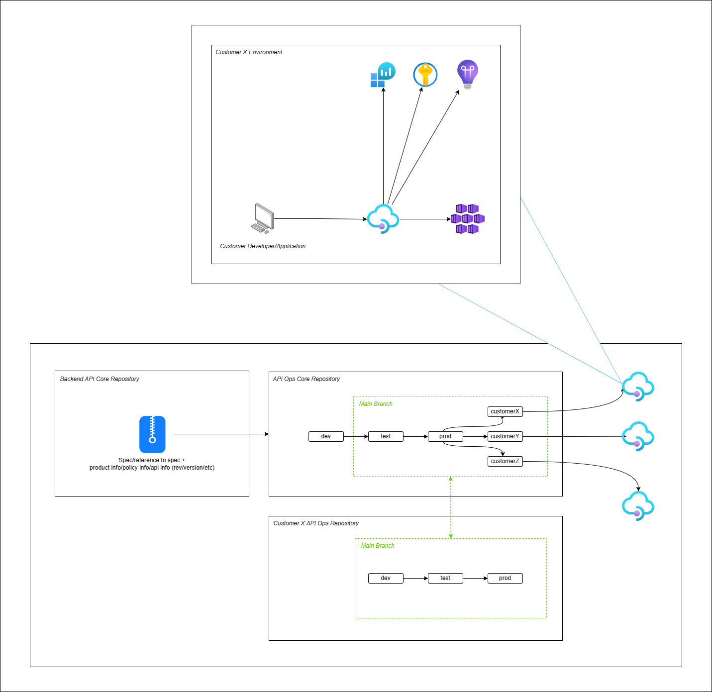

# API Ops

The accelerator demonstrates use of [API Ops](https://azure.github.io/apiops/apiops/0-labPrerequisites/) to deploy changes from a development to production API Management instance that are hosted in separate environments.

Terraform is used to deploy the supporting infrastructure, including the API Management instances, and API Ops handles configuration promotion from the development to production environment.

## Architecture

Two resource groups are deployed, dev and prod, that contain identical resources. A developer SKU instance of API Management is deployed alongside a number of supporting resources - Key Vault, Log Analytics, and Application Insights.



The Application Insights Instrumentation Key is stored as a Key Vault secret, referenced by the API Management ```Logger-Credentials``` named value defined in [/apimartifacts](./apimartifacts/). API Management has a logger resource within /apimartifacts that connects to the Application Insights resource via the ```Logger-Credentials``` named value, and sends diagnostics to Log Analytics.

The values stored in [/apimartifacts](./apimartifacts/) correspond to the dev environment. Importantly, when the configuration is applied to the prod environment, the [configuration.prod.yaml](./configuration.prod.yaml) file is used to override resource ids to point at the prod environment's Key Vault, Log Analytics, and Application Insights resources. 

> **_NOTE:_** The deployed architecture does not currently include the AKS cluster, but rather uses a dummy API provided by the Swagger Petstore. Additionally, the deployed architecture currently only includes the dev and prod environments. Work is ongoing to match the above diagrams.

## Infrastructure overview

For the MVE we'll use 2 environments. Each environment has its own instance of API management in dedicated VNet.

For backend applications we'll use shared AKS cluster. Each environment will have its own Kubernetes namespace. All backend services will be exposed via the same 
ingress and will be available for APIm by urls:
- apim-mve-dev.${some-public-dns-zone}
- apim-mve-prod.${some-public-dns-zone}


## Pre-Requisites

- [Terraform](https://www.terraform.io/downloads.html)
- [Azure CLI](https://docs.microsoft.com/cli/azure/install-azure-cli)

This repository comes with a [Dev Container](https://code.visualstudio.com/docs/devcontainers/containers) and all of the pre-requisites are already installed if you use it.

## Deploying the Infrastructure

Make a copy of the `.env.example` and call it `.env`; then define an Azure region, unique `prefix` and your Azure Subscription Id. Next run the following from a terminal: -

`make infra`

## Create GitHub Environments

Each deployed resource group that includes an APIM service should have a corresponding GitHub Environment. If your logged in Azure user is an Application Administrator in the tenant, the `make infra` step would have created an Enterprise Application and granted Contributor to each of the resource groups. 

This is equivalent of running: -

`az ad sp create-for-rbac -n "apiopslab" --role Contributor --scopes /subscriptions/{subscription-id}/resourceGroups/{resource-group} --sdk-auth`

After you have deployed the infrastructure, the `.env` will have been amended to include the settings that you need to configure GitHub Actions. Navigate to the Settings blade in the Github repository and create a new environment called `dev` with the following secrets, taking values from the environment file.

- `AZURE_CLIENT_ID`
- `AZURE_CLIENT_SECRET`
- `AZURE_SUBSCRIPTION_ID`
- `AZURE_TENANT_ID`
- `API_MANAGEMENT_SERVICE_NAME` (Use `DEV_APIM_NAME`)
- `AZURE_RESOURCE_GROUP_NAME` (Use `DEV_RESOURCE_GROUP_NAME`)


Create a new `prod` environment using the same settings but remembering to use the prod values

- `API_MANAGEMENT_SERVICE_NAME` (Use `PROD_APIM_NAME`)
- `AZURE_RESOURCE_GROUP_NAME` (Use `PROD_RESOURCE_GROUP_NAME`)

## Run the Publisher pipeline

The publisher pipeline will apply the API Management configuration in the main branch to both the dev and prod APIM instances. 

Ensure hardcoded `{SUBSCRIPTION_ID}` values have been replaced with your subscription id and the prefix used in `.env` replaces the one found in `.env.example`.

Navigate to the Actions blade in the GitHub repository and run the Publisher pipeline. Confirm that the changes made to the dev APIM instance in the Azure portal cascaded successfully to the prod APIM instance.

Alternatively, the project dev container contains the publisher utility and can be run using `make publish-dev`.


