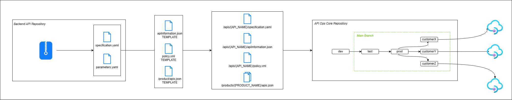

# ADR 0001. Spec Transfer

**Date**: 2023-08-23

## Status

Proposed

## Context

The backend APIs fronted by API Management are developed by a separate team in a different repository. The API Management configuration stored in the [/apimartifacts](../../apimartifacts/) is not a static set of files, and instead must change over time to accommodate changes in the backend APIs.

As backend APIs change, their corresponding Open API Specs (v3) change as well. As new specs are created by the backend API team, the API Ops team must ingest the files and generate the required changes in API Management.

## Proposed Design

To simplify design, we propose that a `/src` folder is created that contains the backend APIs and their specs, rather than using an entirely different repository within the proof-of-concept. Development of the API that will be used for spec transfer is ongoing, captured by [Issue #17](https://github.com/lucashuet93/apiops-vnet-github/issues/17) and is out of scope for this ADR. The `/src` folder will contain the source code for the Java-based API and multiple versions of its spec. We will use the multiple versions to simulate changes to the spec over time.

When a new version of a spec becomes available, a new version or revision to an existing version should be created for the corresponding API Management API. Versions and revisions are captured in API Ops as entirely new folders within `/apimartifacts/apis`. For reference, the Swagger Petstore API that has 3 versions and a second revision on Version 3 has the following corresponding folders in `/apimartifacts/apis`:

- `swagger-petstore/`
- `swagger-petstore-v2/`
- `swagger-petstore-v3/`
- `swagger-petstore-v3;rev=2/`

As a result, a new folder should be created in the `/apimartifacts/apis` folder with a name that corresponds to its new version or revision number on an existing revision. The folder contents should match those expected to exist within an API Ops `/apimartifacts/apis/{API_NAME}/` folder:

- `apiInformation.json`, which contains the API configuration data
- `policy.xml`, which contains the API Policy applied to all API Operations
- `specification.yaml`, which contains the Open API Spec for the API

The `specification.yaml` file for a new version or revision will be the spec that is released by the backend API team. The `apiInformation.json` and `policy.xml` files must be automatically generated.

In addition to the APIM API configuration itself, the API may need to be associated with existing Products. API Ops products are stored in the `/apimartifacts/products` folder, where each Product has it's own directory that corresponds to its name. API Ops uses a few files to define Product configuration, but uses the `/apimartifacts/products/{PRODUCT_NAME}/apis.json` file to set the APIs the Product should be associated with. The `apis.json` file should be updated for each of the Products the new API version/revision should be associated with.

The `backends`, `diagnostics`, `loggers`, and and `named values` folders in `/apimartifacts` folder do not need to be updated on new spec changes. The backend url for the AKS cluster does not change on spec updates and the monitoring configuration for the previous versions/revisions of the API will be applied to the new version/revision as well.

In total, the files that should be added to the `/apimartifacts` folder when the backend API team releases a new spec are:

- `/apis/{API_NAME}/apiInformation.json`
- `/apis/{API_NAME}/policy.xml`
- `/apis/{API_NAME}/specification.yaml`

And the files that should potentially be updated are:

- `/products/{PRODUCT_NAME}/apis.json`

As mentioned, `specification.yaml` comes directly from the backend API team, as it is the new Open API Spec that must be applied to API Management. `/apis/{API_NAME}/apiInformation.json` and `/apis/{API_NAME}/policy.xml` should be automatically generated, and `/products/{PRODUCT_NAME}/apis.json` should be automatically updated.

To generate the new files, we propose that we templatize the three files and create a parameters file that accompanies each release. The backend API team should release a parameters file that accompanies the Open API Spec, that when applied to the templates, generates the right API configuration for the new API version/revision. These files are extremely similar for all APIs, and the properties that differ between them be set via parameter. In the case of `apiInformation.json`, for instance, the `apiVersion`,`apiRevision`, and `apiRevisionDescription` properties should be templatized and set via parameters. The parameters file should additionally designate which API is being updated and whether it is a new version or revision.

The incoming Open API spec and parameters file should trigger automatic generation of the files above, then publish the new configuration to the series of API Management instances, starting with `dev`. The operations should be executed via container in the existing AKS cluster. In order to do so, we propose that we containerize the API Ops Publisher so it can be run inside AKS.

In conclusion, when the backend API team releases a new Open API Spec for the API in the `/src` folder, we will expect a parameters file to accompany it. A new `/apimartifacts/apis/{API_NAME}`folder will be created with a name that corresponds to the new API version or revision. The parameters will be applied to three templates in order to generate the `/apis/{API_NAME}/apiInformation.json` and `/apis/{API_NAME}/policy.xml` that are added to the `/apimartifacts/apis/{API_NAME}`folder, and the `/products/{PRODUCT_NAME}/apis.json` files that will be overwritten in their existing Product folders. A container running in AKS will use the API Ops Publisher to publish the new configuration to all APIM instances.

## Considerations

- We had initially planned to use a separate, upstream repository to house the Java based API and Open API specs to simulate common enterprise architecture. The single repository approach can be extrapolated out to multiple repositories at a later time and makes it simpler for us to develop the release process over the current period (e.g. do not have to create another repo, add contributors, policies, etc.).

## Issues Created

Several GitHub Issues have been created to implement the proposed design:

- [Templatize API Ops files generated on release](https://github.com/lucashuet93/apiops-vnet-github/issues/29)
- [Create parameters file structure for spec transfer template files](https://github.com/lucashuet93/apiops-vnet-github/issues/45)
- [Dockerize API Ops Publisher](https://github.com/lucashuet93/apiops-vnet-github/issues/38)
- [Automate template creation and publish to API Management via Helm](https://github.com/lucashuet93/apiops-vnet-github/issues/44)
- [Determine repository structure changes for API Ops Publisher Dockerfile, etc.](https://github.com/lucashuet93/apiops-vnet-github/issues/40)

## Blockers

The application of API Management revisions by API Ops currently has issues logged against it. The revision issue should be fixed directly on the API Ops repository or worked around if a suitable option exists. The following issue has been logged to track this work:

- [Ensure APIM revisions can be published](https://github.com/lucashuet93/apiops-vnet-github/issues/38)
