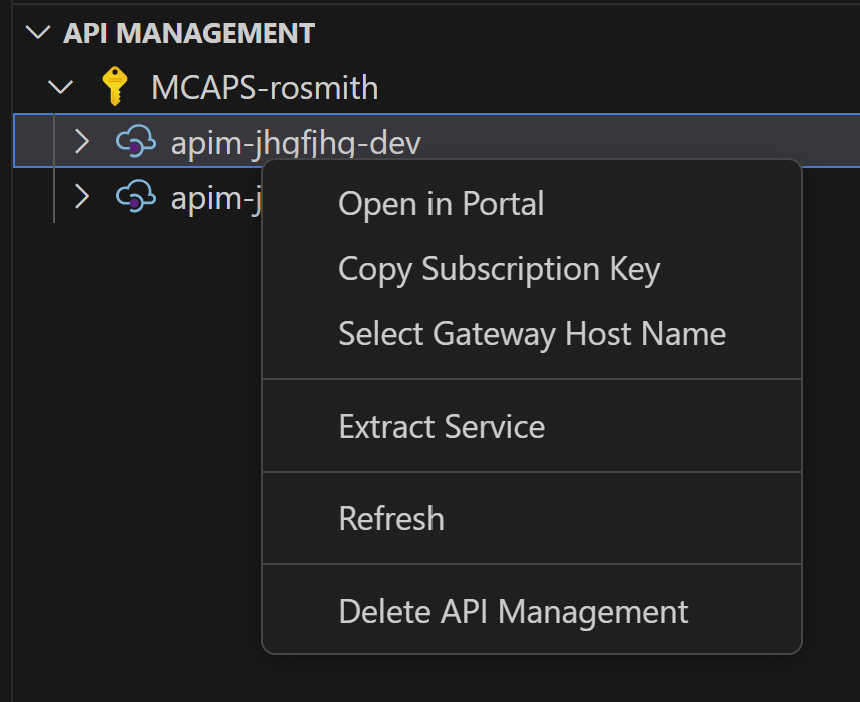
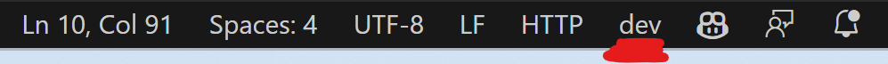

# Testing your API from Visual Studio Code

The DevContainer will install two tools that will you help you test your APIs all from your IDE.
 - [Azure API Management Extension for Visual Studio Code](https://marketplace.visualstudio.com/items?itemName=ms-azuretools.vscode-apimanagement)
 - [REST Client](https://marketplace.visualstudio.com/items?itemName=humao.rest-client)
 
1. Use the APIM extension to Copy APIM Subscription Key by right clicking on the APIM instance

2. Copy this value into the [Settings](../.vscode/settings.json) in the correct environment.

3. Navigate to the API and "Test Operation" and it will generate you a REST file.

4. When you have the editor open with a .http file you will be able to chose which `environment` in the bottom corner of VSCode. This will make sure you subscription key is used when you make a request to APIM 

Happy Testing!